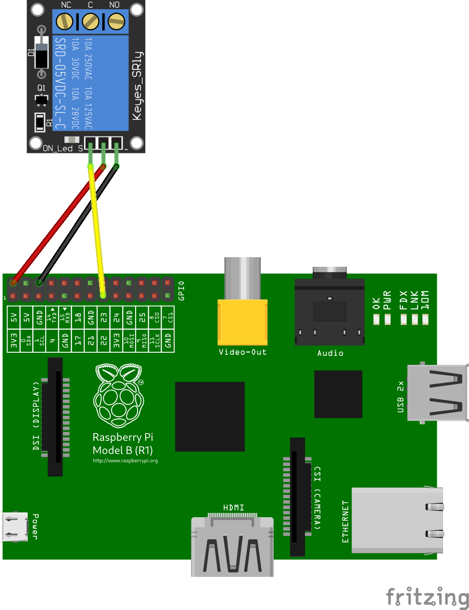

RPi.Relay
#########

Relay state operator, completely written in Python.

RPi.Relay can change relay state, via Raspberry Pi GPIO.

To connect to Raspberry Pi plug into `GPIO PIN 22 <https://pinout.xyz/pinout/pin15_gpio22#>`_ (Physical pin 15) and
POWER PIN. Install and execute raspi-relay and it should work. Alternatively you can user different PIN and execute
raspi-relay with parameter: ``raspi-relay --pin pin_number``.

RPi.Relay supports number of parameters and also configuration file. For more details see ``raspi-relay --help`` or
sample config.

Sensor is based on `RPi.Sensor <https://github.com/ricco386/RPi.Sensor/>`_ library, which make base for implementing
different types of sensors in Python.

Pre-Installation requirements
-----------------------------

- Update system and install required dependencies::

    sudo apt-get update

- Update system and install required dependencies::

    sudo apt-get install build-essential python3-dev python3-pip

Installation
------------

- Install the latest released version using pip::

    pip install https://github.com/ricco386/RPi.Relay/zipball/master

- Alternatively install latest released version from pypi::

    pip install --upgrade RPi.Relay

Integration as a systemd service
--------------------------------

- Make sure all dependencies (listed below) are installed (done automatically when installing via pip)
- The ``raspi-relay`` command should be installed somewhere in your ``PATH`` (done automatically when installing via pip), make sure `raspi-relay.service` has corect path in `ExecStart` set to `raspi-relay` executable.
- Systemd scripts are available: https://github.com/ricco386/RPi.Relay/tree/master/init.d to install them you will need root privileges, so we execute them as sudo::

    sudo cp init.d/raspi-relay.conf /etc/tmpfiles.d/
    sudo cp init.d/raspi-relay.service /etc/systemd/system/
    sudo systemd-tmpfiles --create /etc/tmpfiles.d/raspi-relay.conf
    sudo systemctl enable raspi-relay.service  # Enable service to start at system boot
    sudo systemctl start raspi-relay.service  # Start

Systemd scripts should be run under **default Raspberry Pi user** (pi), scripts have to be able access GPIO.

**Dependencies:**

- `RPi.Sensor <https://pypi.python.org/pypi/RPi.Sensor>`_ (0.5.3+)

Usage
-----

You have to create a `.sensor.cfg` file and place into `/home/pi/.sensor.cfg` you can find example file in RPi.Sensor repo: https://github.com/ricco386/RPi.Sensor/blob/master/sensor.cfg.example and add values in `[Relay]` section.

`raspi-relay` support parameters to overwrite config parameters. For more info run::

    raspi-relay --help

License
-------

For more information see the `LICENSE <https://github.com/ricco386/RPi.Relay/blob/master/LICENSE>`_ file.
